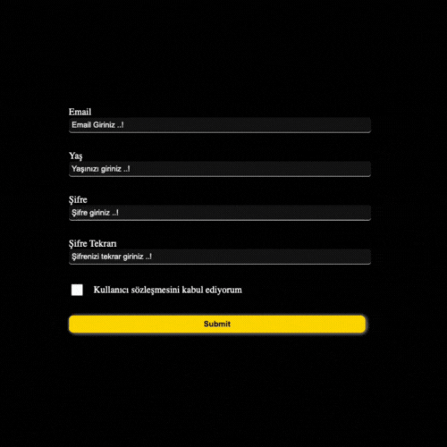

# Form Validation Project

This project is a simple form validation application built with React, Vite, Formik, and Yup. The application demonstrates how to manage and validate forms in a React application using modern libraries and best practices.

  
<h3>Features</h3>
 
-  
<b>Formik:</b> Handles form state management and submission.

-  
<b>Yup:</b> Provides schema-based form validation.

-  
<b>React:</b> Used to create a responsive and interactive user interface.

-  
<b>Vite:</b> A fast build tool for a smooth development experience.

 

 
<h3>Usage</h3>
 

To use the form validation feature, simply fill out the form fields and submit. The form will validate the input according to the defined schema in Yup. If there are any validation errors, they will be displayed below the respective fields.

 

<h4>Form Control Gif</h4>

